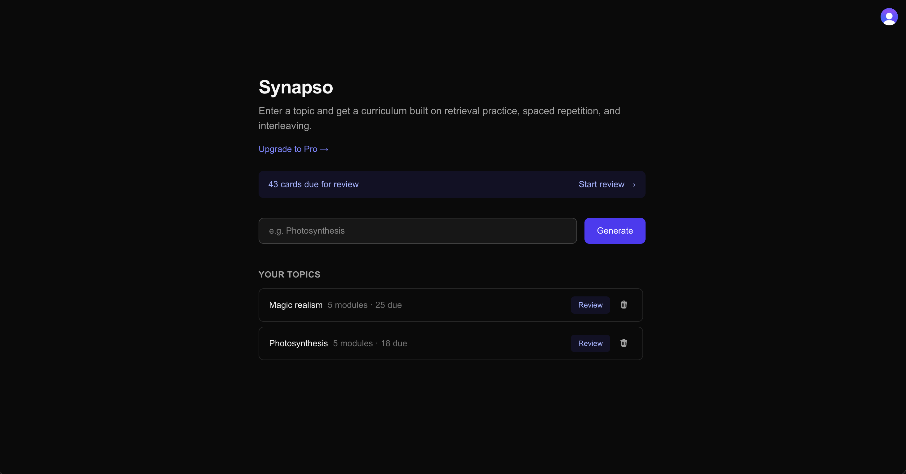
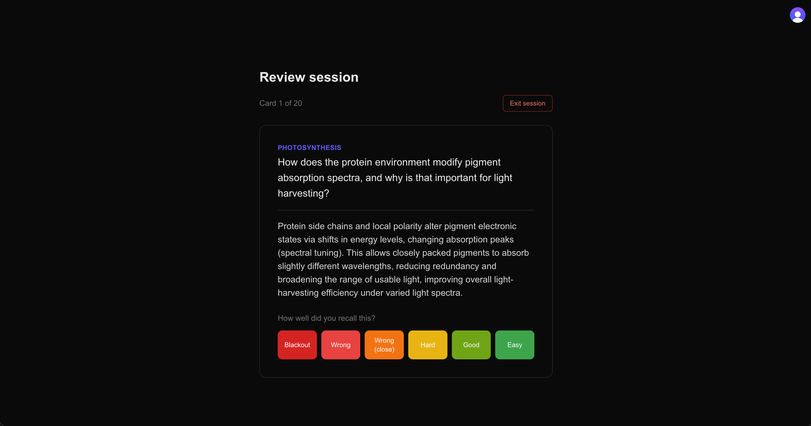
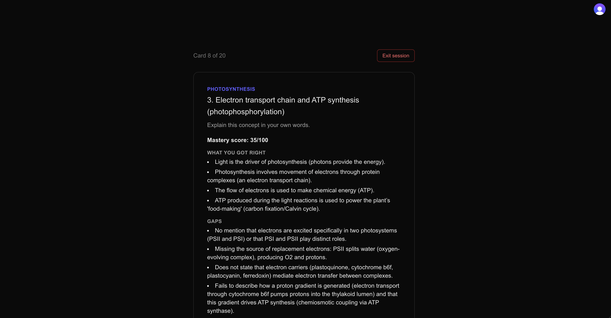

# Synapso

An AI-powered learning platform that generates structured curricula from any topic and helps you actually retain what you learn, using retrieval practice, spaced repetition (SM-2), and the Feynman technique, grounded in cognitive science research (*Make It Stick*, Roediger & Karpicke).

**Live demo:** [synapso-gold.vercel.app](https://synapso-gold.vercel.app)


*Dashboard: generate a new topic, see due reviews across all topics*


*Spaced repetition review: SM-2 scheduling with graded recall (Blackout to Easy)*


*Feynman check: explain a concept in your own words, get an LLM-scored breakdown of what's right and what's missing*

---

## What it does

1. **Enter any topic**: Synapso generates a structured curriculum (3–5 modules) using an LLM prompted with evidence-based learning principles, not just a summary.
2. **Active recall, not re-reading**: each module comes with recall questions where the answer stays hidden until you actively try to remember it first.
3. **Feynman check**: explain a concept in your own words; an LLM evaluates what you got right, what's missing, and gives a mastery score.
4. **Spaced repetition**: both recall cards and Feynman checks are scheduled using the SM-2 algorithm, the same one behind Anki. Review sessions interleave topics deliberately rather than blocking by subject, based on research showing interleaving improves long-term retention.
5. **Free / Pro plans**: a real Stripe subscription flow (test mode) gates unlimited topic generation behind a Pro plan.

## Tech stack

| Layer | Technology |
|---|---|
| Framework | Next.js 16 (App Router, Turbopack) |
| Language | TypeScript |
| Styling | Tailwind CSS v4 |
| Auth | Clerk |
| Database | PostgreSQL (Supabase) via Prisma ORM 7 |
| AI | OpenAI API (`gpt-5-mini`) via Vercel AI SDK, structured outputs |
| Caching | Redis (Upstash) |
| Payments | Stripe (Checkout + webhooks) |
| Data fetching | TanStack Query |
| Testing | Vitest |
| CI | GitHub Actions (lint, test, build on every push) |
| Deployment | Vercel |

## Architecture highlights

- **Structured LLM output, not free text.** Every generation (curriculum, Feynman evaluation) is forced into a Zod schema via the AI SDK's structured output mode, with no regex parsing of model responses.
- **SM-2 implemented from scratch** (`lib/sm2.ts`) as a pure, fully unit-tested function, not a library. Used for both flashcards and Feynman checks, sharing one scheduling engine via a `masteryScore → quality` conversion.
- **Cache-aside on generation.** Repeated topic requests are served from Redis (7-day TTL) instead of re-calling the LLM, cutting both latency (~40s to near-instant) and API cost.
- **Plan limits enforced server-side**, before any LLM call: a Free-tier user hitting their topic cap never triggers a paid API request.
- **Webhook-driven state sync.** Both Clerk (user lifecycle) and Stripe (subscription lifecycle) update the database exclusively through verified webhooks, never trusted client input.
- **Topic input validated by the LLM itself, not a client-side filter.** The structured output schema includes an `isValidTopic` field, so nonsensical input or prompt-injection attempts (e.g. "ignore previous instructions...") get rejected by the model before anything is generated or persisted, with the topic string treated strictly as data in the prompt rather than as instructions.

## Notable trade-offs and decisions

- **No cross-user topic deduplication.** The Redis cache speeds up repeated *generation*, but every user who requests "Photosynthesis" still gets their own `Topic`/`Module`/`Card` rows. Deduplicating shared content across users was judged out of scope for the MVP.
- **LLM non-determinism is accepted, not fought.** Identical Feynman explanations can score a few points differently across runs. Acceptable here since scores drive coarse spaced-repetition scheduling, not precise grading; a fair trade for not adding `temperature: 0` fragility.
- **Interleaved review by default, with an opt-out.** Review sessions mix topics and item types (cards + Feynman checks) by default, reflecting the literature on interleaving. Each topic also has its own scoped "Review" entry point for users who want blocked practice.
- **Application-level cascade delete, not database-level.** `onDelete: Cascade` isn't set in the schema; deleting a topic instead runs a Prisma transaction that removes Reviews, FeynmanChecks, Cards, and Modules in dependency order before deleting the Topic itself. That trade favors explicit, auditable deletes over an automatic DB-level cascade, at the cost of a single spot in the codebase that needs updating if a new child model is added under Module later.

## Engineering notes

Bugs found, root causes, and fixes.

### Security: `/dashboard` was accessible without auth

At some point `middleware.ts` had been overwritten with Clerk's bare quickstart `clerkMiddleware()`, with no callback, so it protected nothing by default. Root cause traced further back: Clerk deprecated path-based `createRouteMatcher()` middleware protection in favor of **resource-based auth checks** (protecting at the page/data level instead of the route level). Fixed by adding server-side auth-checking layouts for `/dashboard` and `/review` rather than relying on middleware path matching. No data was actually exposed in this window, since every API route already checked auth independently; the page itself was simply rendering for logged-out users.

### Redis double-serialization

`@upstash/redis` auto-serializes/deserializes JSON under the hood. Calling `JSON.stringify()` / `JSON.parse()` manually on top of that double-processes the data and throws `"[object Object]" is not valid JSON`. Fixed by passing and reading plain objects directly and letting the SDK handle serialization. A good example of reading a library's actual behavior instead of assuming it works like a raw key-value store.

### Silent UI bug from a leftover state variable

Refactoring `/api/generate` and the dashboard to remove client-side polling left a stale `curriculum` state variable that was never reassigned after the refactor. Its render condition, `{curriculum && (...)}`, stayed permanently `false` even though the real `modules` data was being correctly fetched, so the UI just silently didn't render, no console error, no failed request. Caught by noticing the network tab showed successful data while the screen stayed empty.

### Stale dashboard data across users on sign-out

Signing out left the *previous* user's dashboard data briefly visible to whoever signed in next, on the same browser. Cause: a shared, browser-wide TanStack Query `QueryClient` singleton wasn't being cleared on auth state change. Fixed with a small client component that calls `queryClient.clear()` whenever Clerk's `isSignedIn` flips to `false`.

## Local development

```bash
git clone https://github.com/sharmarkeGit/synapso.git
cd synapso
npm install
```

Copy `.env.example` to `.env` and fill in the required keys (Clerk, Supabase/Postgres, OpenAI, Stripe, Upstash; see file for the full list).

```bash
npx prisma migrate dev
npm run dev
```

Runs at `http://localhost:3000`.

### Scripts

```bash
npm run dev      # start dev server
npm run build    # prisma generate + production build
npm run lint     # ESLint --fix (includes import sorting)
npm run format   # Prettier --write
npm run test     # run unit tests once
npm run test:watch  # watch mode
```

## Testing

Unit tests cover the SM-2 scheduling algorithm and Zod input validation (`lib/sm2.test.ts`, `lib/validations.test.ts`). CI runs lint, tests, and a full production build on every push and pull request to `main`.

---

Built by [Sharmarke Youssouf](https://github.com/sharmarkeGit).